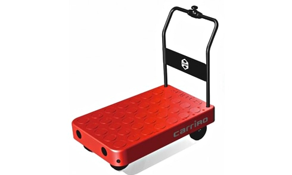
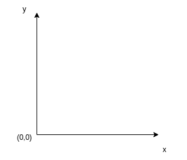
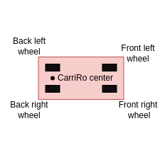
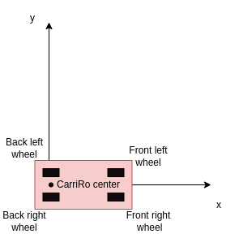
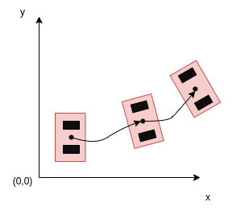
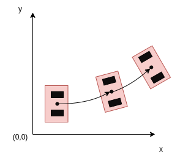
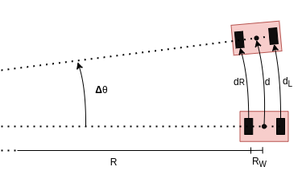
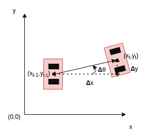

# Dead reckoning system for CarriRo AD form factor

## Index

1. Introduction to dead reckoning
1. Mathematical representation of dead reckoning
1. Functionnal overview of the code
1. How to build and test the code
1. Room for improvements
1. Bibliography

## Introduction to dead reckoning

### What is dead reckoning ?

In navigation, dead reckoning is the process of calculating current position of some moving object by using a previously determined position, or fix, and then incorporating estimates of speed, heading direction, and course over elapsed time. The corresponding term in biology, used to describe the processes by which animals update their estimates of position or heading, is path integration.[^1]

### Why would we need dead reckoning in our system ?

In our case, we consider the CarriRo AD as being the robot in wich we will implement dead reckoning:

  
   
  <b>Fig.1 CarriRo Image</b>

As far as I know, the idea behind this robot is to have an autonomous moving cart that can handle heavy loads transportation. A dead reckoning system would give to this robot, the capability of knowing its current position in a 2D plane from an initially known position. That is an essential part when comming to autonomous mooving robots.

In this use case, we have the following informations :
- The two rear wheels are driving wheels
- The two frony wheels are swivel caster wheels
- We can get the odometry of the 4 wheels
- We can get the yaw rate of the whole robot

## Mathematical representation of dead reckoning

### Dead reckoning with odometry and yaw rate

In order to estimate our position, we have two kind of informations available. The 4 wheel odometry and the yaw rate. In this case, we will use odometry to caclulate the robot shift, and the gyrometer to calculate the angle shift. We could use odometry alone to extract both of this parameters, but the gyrometer should be more precise when extracting the yaw angle.

### Coordinate system and robot initial position

We will use an orthonormal coordinate system. Where at initialization, *CarriRo AD* 0 coordinate is at the coordinate system origin. It is important to note that our *CarriRo AD* origin is the middle between the two rear wheels (for simplicity purposes). Finally, carriro is facing the positive X axis.

  
   
  <b>Fig.2 Coordinates system</b>

  
   
  <b>Fig.3 CarriRo representative illustration</b>

  
   
  <b>Fig.4 CarriRo inital position in the plane</b>

The angle &#952; is the angle between the direction of the robot and the x axis.

So at the begining, our coordinates are the following ones :
- x = 0
- y = 0
- &#952; = 0

### From the physics to the maths

In this section, we will cover how the odometry and yaw rate can be used to extract the absolute robot position.[^2]

First of all, we simplified the problem by taking in account only the two rear wheels because the front ones does not have driving capacity.

The following image shows an example that could be a CarriRo movement trajectory.

  
   
  <b>Fig.5 CarriRo real robot movement representation</b>

This trajectory can be decomposed in small curved segments as in the following image:

  
   
  <b>Fig.6 CarriRo segmented robot movement representation</b>

If we focus on a single segment, we can extract the yaw angle and robot shift:

  
   
  <b>Fig.7 CarriRo segment data</b>

From the representation of our robot, we can extract the following set equations:

- dR = (R + 2*RW)*&Delta;&theta;
- dL = R*&Delta;&theta;
- d = (R + RW)*&Delta;&theta;

With some basic maths, we get to the following equation:
- d = (dR + dL)/2

### From relative movement to absolute coordinates

In the last section, we just extracted the robot movement regarding the last segment, but now, we need to use this in order to know where our robot is in the absolute coordinates system. In order to do that, we need to convert the yaw angle and the position shift to an x and y coordinates and to an absolute angle between the x axis and the robot direction.

To simplify things, we imagine that the robot does a slight rotation on the spot before going straight. This allows us to use the d distance as if it was straight forward:

  
   
  <b>Fig.8 Robot shift to absolute coordinates</b>

**Legend :**
- y: y axis
- x: x axis
- (xt-1, yt-1): last scan coordinates
- (xt, yt): new scan coordinates
- &Delta;&theta;: yaw angle between last direction and new direction
- &Delta;x: variation on x axis
- &Delta;y: variation on y axis
- &theta;t: absolute angle between x axis and the robot direction
- &theta;t-1: absolute angle between x axis and the robot direction in the last scan

To update our absolute angle, we take the yaw angle and add it to the last angle:
- &theta;t = &Delta;&theta; + &theta;t-1

With some trigonometry, we can extract &Delta;x and &Delta;y:
- &Delta;x = d cos(&theta;t)
- &Delta;y = d sin(&theta;t)

And our new absolute coordinates are:
- xt = xt-1 + &Delta;x
- yt = yt-1 + &Delta;y
- &theta;t

## Functionnal overview of the code

### Mockup of the gyrometer and odometry acquisition

[talk about the suppositions on odometry returns and yaw rate details]

### How is built the library and how to use it

## Build and test

### Requirements

### Build and test commands

[talk about the debug flag and how to remove]

## Room for improvements

### Thread safety

### Global positionning system and Kalman filter

[if speed component not added, add it to it]

## Bibliography

[^1]: Wikipedia : https://en.wikipedia.org/wiki/Dead_reckoning
[^2]: A good explanation : https://www.youtube.com/watch?v=LrsTBWf6Wsc&t=1554s
